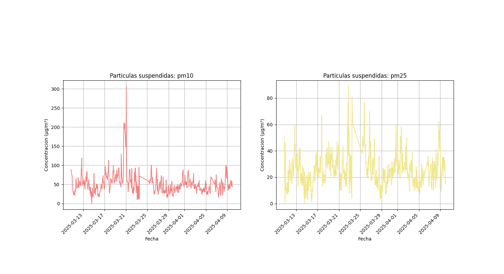

# Air Quality Analysis in CDMX (La Merced) - OpenAQ

This project conducts an exploratory analysis of pollutant levels in the **La Merced** area of Mexico City, using open data from the [OpenAQ](https://openaq.org/) platform.

---

# Objective

To explore, visualize, and extract preliminary insights about air quality, focusing on compounds such as:

- Carbon Monoxide (CO)
- Sulfur Dioxide (SO₂)
- Nitrogen Oxides (NO, NO₂, NOₓ)
- Ozone (O₃)
- Suspended Particles PM10 and PM2.5

---

# Structure

- `air_quality_CDMX_es.ipynb`: notebook containing the full analysis and visualizations  
- `air_data_CDMX.csv`: dataset downloaded from OpenAQ (La Merced, 1 month)

---

# Visualizations

Some plots included in the analysis:

---

# Tools Used

- Python  
- Pandas  
- Seaborn  
- Matplotlib  
- Google Colab

---

# Main Conclusions

- The most prevalent pollutant is **Carbon Monoxide (CO)**.
- Outliers were observed in compounds such as **NOₓ and SO₂**.
- **PM2.5 particles** show greater variability than **PM10**, as expected.
- The analysis was based on one month of data from a single station (La Merced).

---

# Data Source

[OpenAQ Platform - La Merced, CDMX](https://openaq.org)

---

# Author

**Mateo Chavez**
